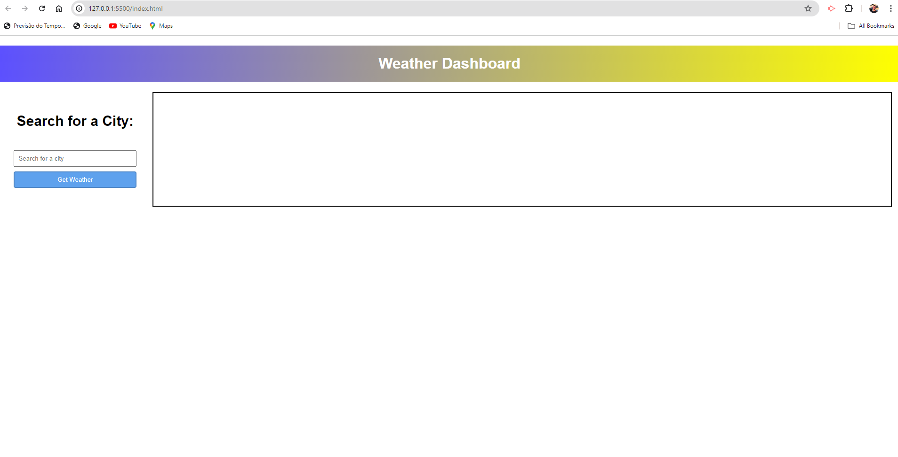
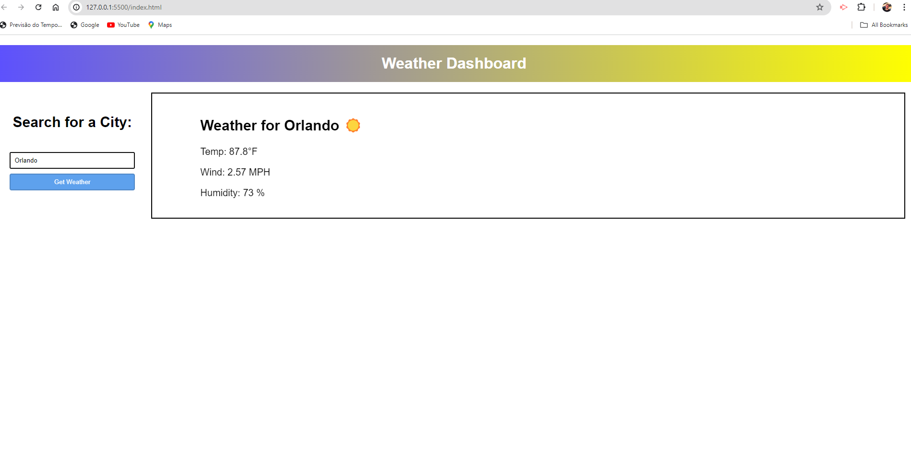

# Module-06-Challenge

WEATHER DASHBOARD

## Description

This project is a weather dashboard. The goal of this website was to make a field where the client puts the name of the city he wants to know the weather, and whenerver he submits it will show the weather from the city, and for the next 5 days, createing also a history of the cities searched. Due to the time of the activity together with the project, i wasnt able to complete the 5 days weather and the history of the cities searched, wHat i was able to do was the weather from today. 

## Usage

To use the website, you just write the city on the input and click on submit to show the weather from today for, the city choose.

## Credits

N/A

## License

 MIT License

 ## Images
 
 